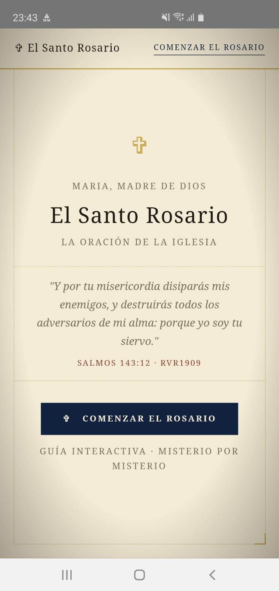
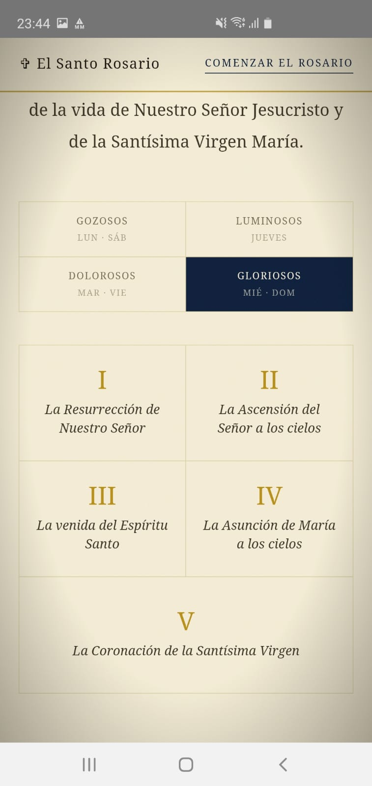
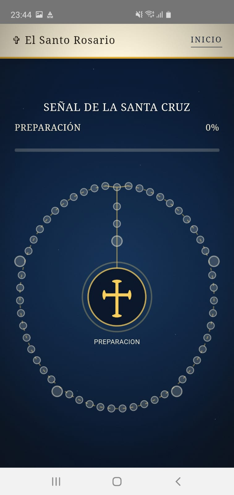
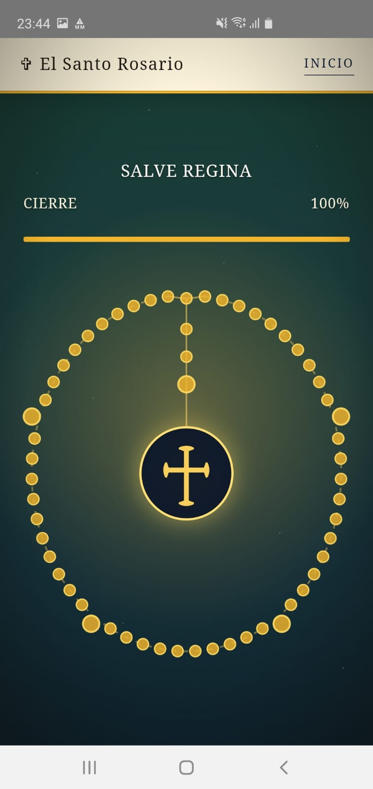

Santo Rosario
=============

Aplicacion web simple para rezar el Santo Rosario, empaquetada como APK Android con Capacitor.

La app esta pensada como una guia practica para acompanar el modo habitual de rezar el Rosario en Argentina: presenta los misterios correspondientes al dia, acompana el avance por las cuentas y muestra el estado del rezo sin depender de conexion a internet.

## Capturas

| Inicio | Misterios del dia |
| --- | --- |
|  |  |

| Rosario interactivo | Rosario completado |
| --- | --- |
|  |  |

## Funcionamiento

- Funciona offline: no necesita backend, cuenta de usuario ni conexion permanente.
- Detecta el dia de la semana y selecciona automaticamente los misterios correspondientes.
- El inicio muestra informacion del Rosario, los misterios del dia, un versiculo biblico diario y una frase latina diaria con traduccion.
- La pantalla de cuentas funciona como guia de rezo: la cruz central permite avanzar y el rosario visual se actualiza cuenta por cuenta.
- El estado del rezo se conserva durante el dia y se reinicia automaticamente al cambiar de fecha.
- Al completar el Rosario, la app marca el cierre visualmente y permite comenzar de nuevo.
- Incluye estructura i18n para 12 idiomas y toma el idioma del dispositivo cuando el catalogo esta disponible.

## Idiomas

Los textos generales de la aplicacion viven en `www/i18n/`. Hay catalogos disponibles para:

```text
es, pt, en
```

Los demas catalogos objetivo existen como estructura preparada, pero quedan deshabilitados hasta revisar sus oraciones completas:

```text
pl, it, fr, fil, de, vi, ro, hr, hu
```

La etiqueta del selector queda siempre como `Language` para que sea reconocible aunque la app este en otro idioma. La frase diaria de la Biblia y la frase latina tienen tratamiento separado en `www/data/versiculos.js` y `www/data/latin.js`.

Nota editorial: las traducciones son una primera version funcional. Antes de publicar un idioma como version pastoral definitiva conviene revisarlo con hablantes nativos y, especialmente, con fuentes liturgicas apropiadas para las oraciones largas.

## Estructura principal

```text
www/
  index.html
  cuentas.html
  css/styles.css
  js/app.js
  i18n/
    languages.js
    es.js, pt.js, en.js, pl.js, it.js, fr.js, fil.js, de.js, vi.js, ro.js, hr.js, hu.js
    i18n.js
  data/
    versiculos.js
    latin.js
  citas-rvr1909.txt
android/
docs/readme-images/
assets/
tools/generate_i18n.py
listado_idiomas.csv
```

## Comandos utiles

```bash
npm.cmd install
npm.cmd run sync
npm.cmd run build:android
```

El APK debug queda en:

```text
android/app/build/outputs/apk/debug/app-debug.apk
```

## Notas tecnicas

- `www/` es el `webDir` de Capacitor.
- Las imagenes para documentar el proyecto en este README van en `docs/readme-images/`.
- Se quitaron fuentes remotas para que la experiencia funcione offline con fuentes del sistema.
- Los datos diarios se cargan desde archivos JS en `www/data/`, no desde JSON, para funcionar bien offline, en Capacitor y en pruebas locales.
- Los textos traducibles se cargan desde archivos JS en `www/i18n/`.
- `tools/generate_i18n.py` regenera `languages.js` y los catalogos de idioma.
- `cuentas.html` usa un rosario SVG interactivo: la cruz central es el boton de avance, con pulso inicial.
